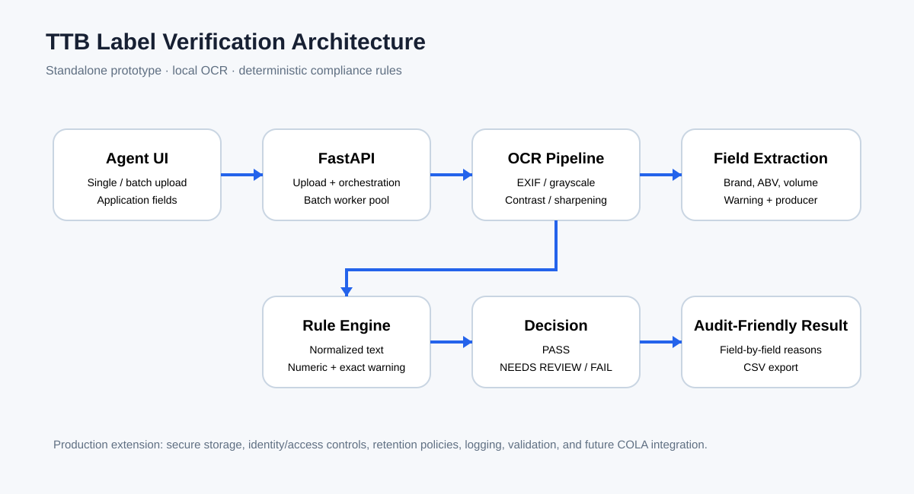

# TTB AI-Powered Alcohol Label Verification App

A standalone proof-of-concept for automated alcohol-label verification. The prototype uses local OCR to extract label text, normalizes common formatting differences, compares extracted fields with application data, and returns explainable **PASS / NEEDS REVIEW / FAIL** results.



## Take-home approach

The design is intentionally conservative. OCR is the AI-assisted portion, while compliance checks remain deterministic and visible to the reviewer. This avoids turning a prototype into a black-box approval system and makes each result explainable.

The application is standalone and does not integrate with COLA. Batch processing is supported because the stakeholder interviews describe peak workloads containing hundreds of labels. The UI is intentionally low-complexity for agents with different levels of technical comfort.

## Features

- Single and batch image upload
- Local Tesseract OCR, with no cloud OCR dependency
- EXIF rotation handling
- Grayscale, autocontrast, sharpening, and lightweight thresholding preprocessing
- OCR confidence from word-level Tesseract data
- Extraction of brand, class/type, ABV, net contents, producer/bottler name, producer/bottler address, country of origin, and government warning
- Normalized text matching for ordinary capitalization/punctuation differences
- Numeric matching for ABV and net contents
- Exact government-warning comparison
- Explainable PASS / NEEDS REVIEW / FAIL results
- Concurrent batch processing with a bounded worker pool
- CSV export
- Responsive agent-oriented interface
- Health endpoint

## Demo fixtures

Synthetic labels are included under `sample_labels/` so reviewers can test the prototype immediately.

- `01_pass_clean.jpg` — clean baseline
- `02_pass_rotated.jpg` — mild rotation
- `03_pass_glare.jpg` — glare simulation
- `04_fail_warning.jpg` — altered government warning
- `05_review_rotated_glare.jpg` — combined image-quality stress case
- `06_fail_abv.jpg` — deterministic ABV mismatch

See [`docs/test-matrix.md`](docs/test-matrix.md) for the expected behavior. These are synthetic demonstration labels, not official TTB approvals.

## Run locally

### Docker

```bash
docker build -t ttb-label-verification .
docker run --rm -p 8000:8000 ttb-label-verification
```

Open `http://localhost:8000`.

### Python

Install Tesseract separately, then:

```bash
python -m venv .venv
source .venv/bin/activate
pip install -r requirements.txt
uvicorn app.main:app --reload
```

Open `http://localhost:8000`.

## API

- `GET /api/health`
- `POST /api/verify` — one image
- `POST /api/batch` — multiple images
- `POST /api/export-csv` — results export

## Verification model

### Text fields

Brand, class/type, producer/bottler name, producer/bottler address, and country use normalized comparison. Country of origin is treated as application data when applicable, such as imported products; leaving an application field blank skips that comparison. Capitalization and ordinary punctuation differences are normalized before comparison.

### Numeric fields

ABV and net contents are compared numerically. This means `45%` and `45.0%` represent the same numeric value for the prototype.

### Government warning

The government warning uses the statutory wording as the reference text. Exact extracted wording passes; likely OCR corruption is routed to `NEEDS REVIEW`; reliable material changes fail. The prototype checks wording and capitalization from OCR text. It does **not** claim to reliably verify visual typography such as bold weight, minimum type size, characters per inch, contrast, or placement. Those require layout/vision analysis and remain a production enhancement.

### Human review

A low OCR confidence score produces `NEEDS REVIEW` when there are no deterministic failures. This preserves a human-in-the-loop path for poor images and ambiguous extraction.

## Architecture

1. **Agent UI** accepts application fields and one or many images.
2. **FastAPI** handles upload and bounded batch concurrency.
3. **OCR pipeline** corrects EXIF orientation and applies local image preprocessing.
4. **Field extraction** turns OCR text into structured fields.
5. **Rule engine** performs normalized, numeric, and exact-warning checks.
6. **Decision layer** produces PASS, NEEDS REVIEW, or FAIL.
7. **Result UI** exposes field-by-field reasons and supports CSV export.

## Assumptions and trade-offs

1. This is a prototype, not a production compliance system.
2. Application fields are entered by the reviewer rather than fetched from COLA.
3. OCR quality depends on image quality and the local Tesseract model.
4. The prototype uses a fixed standard warning string for the demonstration workflow.
5. Human review remains necessary for ambiguous OCR, image-quality problems, and regulatory nuance.
6. Uploaded image bytes are processed in memory and are not intentionally persisted by the application.
7. Production deployment would require federal security controls, retention policies, access control, audit logging, monitoring, model/OCR validation, and formal regulatory review.
8. No attempt is made to claim that the prototype determines legal compliance for every beverage category or regulatory exception.
9. Government-warning typography (including bold weight and type-size/placement rules) is not reliably validated by text OCR and is documented as a production enhancement.
10. Batch upload is implemented with bounded concurrency, but production-scale throughput for 200–300 applications has not been load-tested; a production design would use queued/background workers and capacity testing.

## Testing

Run:

```bash
PYTHONPATH=. pytest -q
```

The included unit tests cover field extraction, producer/bottler address handling, optional application fields, passing verification, OCR ambiguity, multi-panel aggregation, numeric mismatches, and government-warning failures.

## Scope rationale

The take-home asks for a working core application with clean code, appropriate technical choices, good UX/error handling, attention to requirements, and documented trade-offs. The prototype prioritizes those areas instead of attempting a multi-million-dollar COLA rebuild or a production federal deployment.

## Deployment

The Docker image is suitable for container hosting such as Google Cloud Run. Blocking Tesseract OCR runs in a bounded worker pool so the FastAPI event loop remains available for health checks while OCR is in progress. Uvicorn binds to the platform-provided `PORT` environment variable. Health check path: `/api/health`.

Add the final public deployed URL here before submission so reviewers can open the prototype directly from the repository.

## Latency-oriented OCR strategy

The OCR pipeline is optimized around the prototype's interactive latency requirement. Each label first receives one source-resolution Tesseract pass after lightweight grayscale/contrast preprocessing. A more expensive 1.5x-resolution retry runs only when OCR confidence is low, too few fields are found, or a critical numeric field (ABV/net contents) is missing. Text ambiguity is routed to human review instead of repeatedly OCRing every image. Batch OCR remains bounded to two workers so the API and health endpoint stay responsive on lightweight hosts.

The stakeholder target is approximately five seconds for routine interactive verification. Record the final Cloud Run measurements here before submission rather than treating a development-machine benchmark as hosted performance:

- Warm single-label request: `TODO: measured seconds`
- Six-label batch: `TODO: measured seconds`

Hosted latency varies with image complexity, OCR fallback retries, instance CPU, cold starts, and contention. Cold-start latency should be reported separately from warm request latency.

## Multi-panel application verification

When an application includes multiple images for the same product (for example front and back panels), select **One application: images are front/back/other panels**. The service OCRs the panels concurrently, aggregates field evidence across the set, records the source image for each extracted field, and produces one application-level PASS / NEEDS REVIEW / FAIL result. **Batch** mode remains available when each uploaded image represents a separate label/application.

The verifier treats implausible numeric OCR (for example an alcohol percentage above 100%) as uncertain evidence requiring human review rather than a hard compliance failure. Plausible, confidently extracted numeric conflicts remain hard failures.
